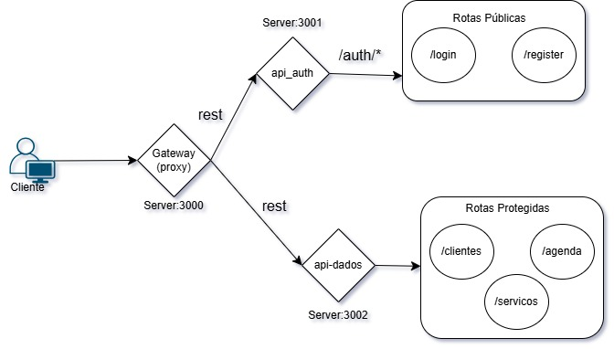
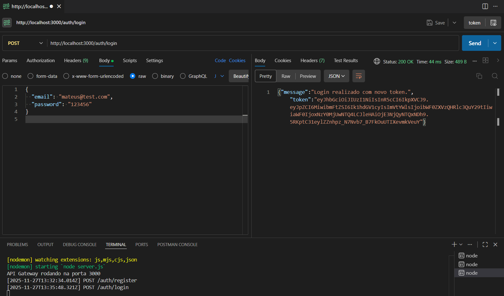
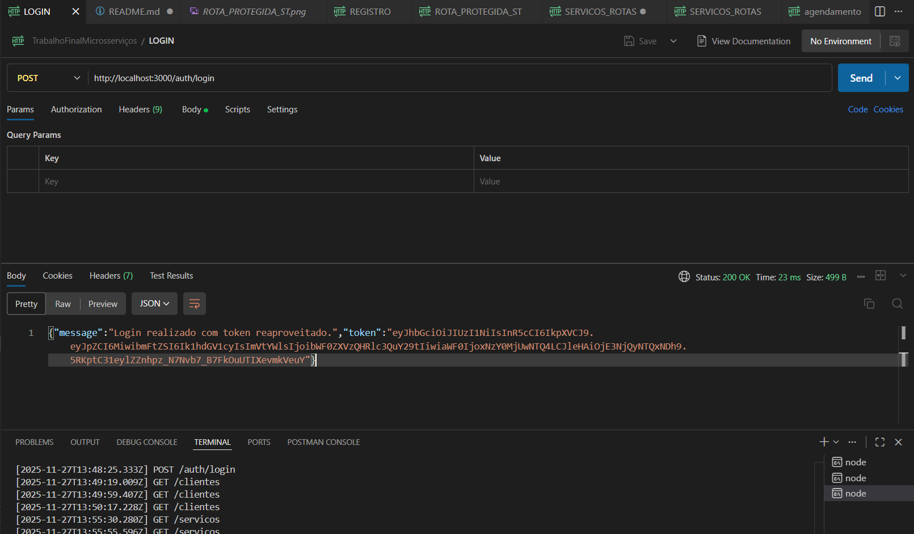
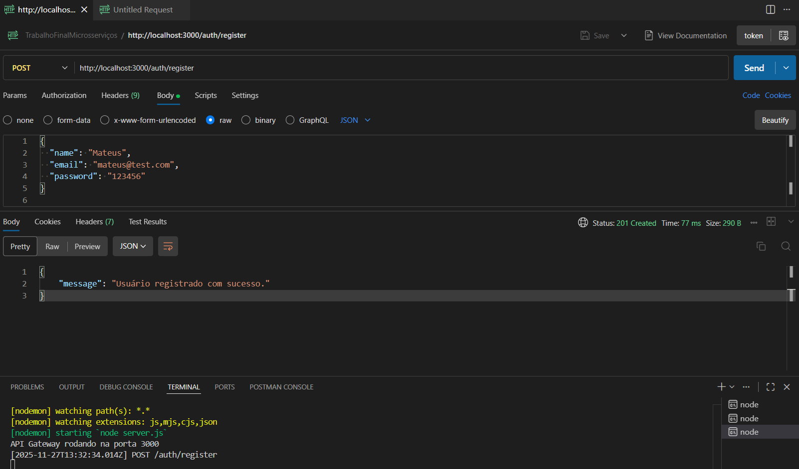
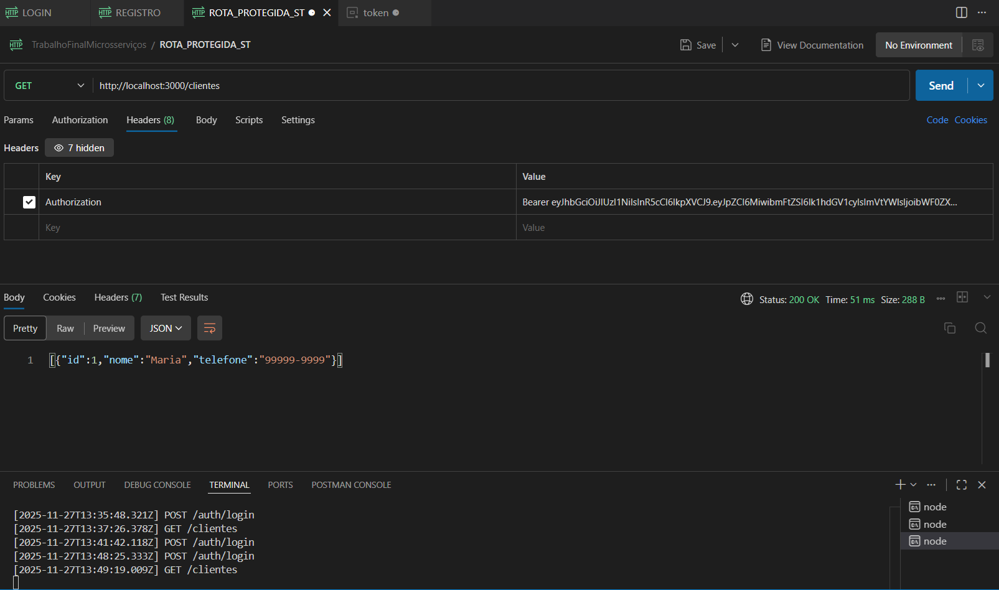
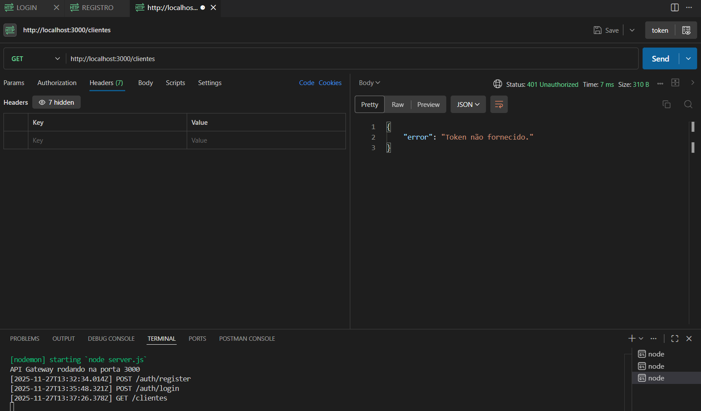
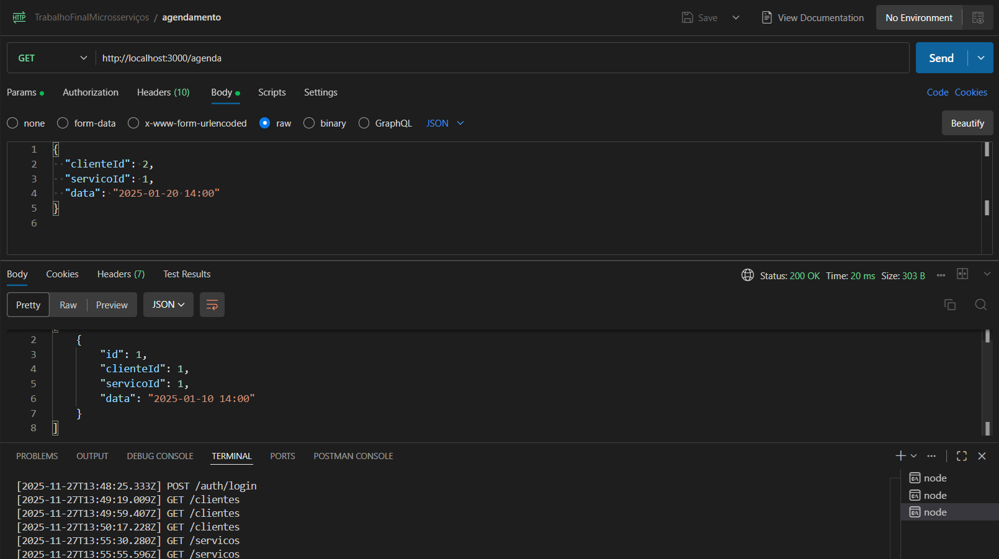

---

# 📘 **README.md – Arquitetura de Microsserviços (Node.js + API Gateway) de um Sistema de Salão de Manicure**

Neste projeto foi desenvolvido uma arquitetura de microsserviços para um sistema de salão de manicure, como proposta de trabalho para Serviços Web do curso Bacharel de Ciências da Comutação.

---

# **1. Arquitetura Geral**

A aplicação foi dividida em **dois microsserviços**, acessados exclusivamente por meio de um **API Gateway**:

### ✔ `api-auth`

Responsável por:

* registro de usuários
* login
* sessão e reutilização de tokens
* validação de credenciais

### ✔ `api-dados`

Responsável por:

* clientes
* serviços do salão
* agenda
* rotas protegidas (acesso mediante token JWT)

### ✔ `gateway`

Responsável por:

* ser a porta de entrada da aplicação
* rotear todas as requisições
* validar tokens
* enviar requisições para os serviços corretos
* proteger os microsserviços
* centralizar logs e regras comuns

---

# **2. Diagrama da Arquitetura**



---

# **3. Como Rodar o Projeto**

## **3.1 Pré-requisitos**

* Node.js 18+
* NPM
* Três terminais ou três processos simultâneos

---

# **4. Subindo os serviços**

## **4.1 API de Autenticação – `api-auth`**

```bash
cd api-auth
npm install
npm run dev
```

Rodará em:
➡ **[http://localhost:3001](http://localhost:3001)**

---

## **4.2 API de Dados – `api-dados`**

```bash
cd api-dados
npm install
npm run dev
```

Rodará em:
➡ **[http://localhost:3002](http://localhost:3002)**

---

## **4.3 API Gateway – `gateway`**

```bash
cd gateway
npm install
npm run dev
```

Rodará em:
➡ **[http://localhost:3000](http://localhost:3000)**

---

# **5. Fluxo de Autenticação**

A autenticação usa JWT e inclui **reutilização de tokens ativos**:

* se o usuário já tem um token ativo → o mesmo é retornado
* se estiver expirado → um novo é gerado
* sessões são armazenadas em memória

No Gateway, rotas protegidas exigem:

```
Authorization: Bearer TOKEN
```

---

# **6. Rotas Disponíveis (via Gateway)**

Todas as rotas abaixo são acessadas usando **[http://localhost:3000/](http://localhost:3000/)**

---

# **6.1 Rotas de Autenticação (públicas)**

| Método | Rota           | Descrição                                   |
| ------ | -------------- | ------------------------------------------- |
| POST   | /auth/register | Registrar usuário                           |
| POST   | /auth/login    | Fazer login e receber token                 |
| GET    | /auth/me       | Dados do usuário logado (token obrigatório) |

---

# **6.2 Rotas de Clientes (protegidas)**

| Método | Rota          | Descrição        |
| ------ | ------------- | ---------------- |
| GET    | /clientes     | Lista clientes   |
| POST   | /clientes     | Cria cliente     |
| PUT    | /clientes/:id | Atualiza cliente |
| DELETE | /clientes/:id | Remove cliente   |

---

# **6.3 Rotas de Serviços (protegidas)**

| Método | Rota      | Descrição         |
| ------ | --------- | ----------------- |
| GET    | /servicos | Lista serviços    |
| POST   | /servicos | Cria novo serviço |

---

# **6.4 Rotas de Agenda (protegidas)**

| Método | Rota    | Descrição          |
| ------ | ------- | ------------------ |
| GET    | /agenda | Lista agendamentos |
| POST   | /agenda | Cria agendamento   |

---

# **7. Testes **

### ✔ Login com usuário 



### ✔ Login com usuário com token válido



### ✔ Registro de novo usuário



### ✔ Acesso permitido com token



### ✔ Requisições negadas sem token



### ✔ Testes de serviços e agendamentos


---


# 📩 **Autor**

**Mateus de Freitas Invernisi**
Serviços Web / Ciência da Computação – IFSul

---
